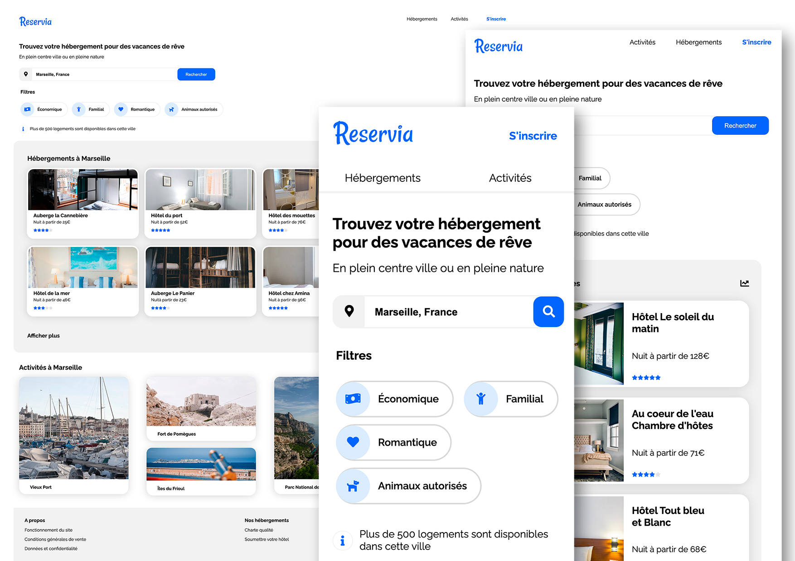

# Reservia

:tada: Ce projet est issu du parcours "Développeur Front-End" de OpenClassrooms.

Objectif : Intégrer une maquette

## Livrables

### Page

- Page d'accueil

#### Page d'accueil

Le menu : Les liens hébergements et activités mènent aux sections de la page.

Recherche : L'utilisateur peut éditer le texte. La fonctionnalité n'est pas encore implémenté.

Les filtres : Au survol et au clic, le style change.

Les hébergements et activités : Les cartes sont cliquables.

#### Design

Les images : La taille est adéquate pour bien mettre en avant les hébergements et activités sans impacter le temps de chargement.

### Contraintes

#### Langages de programmation

- [x] HTML
- [x] CSS

#### Responsive

- [x] Mobile
- [x] Tablette
- [x] Desktop

#### Validation W3C

- [x] W3C HTML
- [x] W3C CSS

#### Compatibilité

- [x] Safari
- [x] Chrome
- [x] Mozilla

